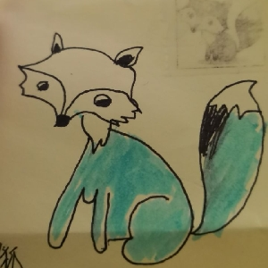

<!-- 音乐播放控制 -->

▶

<!-- 音乐播放器 -->
<iframe 
  id="music-iframe" 
  frameborder="no" 
  style="display: none;" 
  src="//music.163.com/outchain/player?type=2&id=2043177987&auto=1&height=66"
></iframe>

<!-- 首页内容 -->

  

    <h5>我真的不知道偷图,找到我就去找百度。</h5>
    
    <h2>你好，我是 圆滚滚的小毛 欢迎来到 我的网页</h2>
  

  
  

    

      
姓名：圆滚滚的小毛

    

    

      
性别：男

    

    

      
籍贯：福建南平人

    

    

      
所在地：厦门（或者广州？）

    

    

      
QQ：1535878824

    

    

      
电话：18059267295

    

    

      
zzy1535878824@163.com

    

    

      
<---联系我(ovo)

    

  

<!-- 时间显示 -->
<iframe src="./test_addess/time.html" style="position: fixed;top: 20vh;left: 10px;"></iframe>

<!-- 自我介绍 -->
<iframe class="self" src="Bet_On_Me.html"></iframe>

<!-- 联系表单 -->

  <h4 style="text-align: center; color: aquamarine;">
    联系我 
    

  </h4>
<form action="https://api.your-backend.com/submit" method="POST">
<input type="hidden" name="_redirect" value="https://yourdomain.com/thank-you">
<input type="hidden" name="_repo" value="BiliBiliSmallball/your-repo">
    <label>
      
您是？

      <input type="text" name="name" placeholder="您的姓名？" required />
    </label>
    <label>
      
您的邮箱？

      <input type="email" name="email" required />
    </label>
    <label>
      
说啥？

       
      <textarea name="message" required style="max-width: 761px; max-height: 62px;width: 100vh;height: 10vh;"></textarea>
    </label>
    <label>
      联系形式:
      <input type="radio" name="link_function" value="QQ" required />QQ
      <input type="radio" name="link_function" value="email" />e-mail
      <input type="radio" name="link_function" value="微信" />微信
      <input type="radio" name="link_function" value="飞书" />飞书
    </label>
    <button type="submit">发送</button>
  </form>

<!-- 页脚 -->

  网站备案号: <del>没有的啦</del> 
  E-mail: zzy1535878824@163.com

